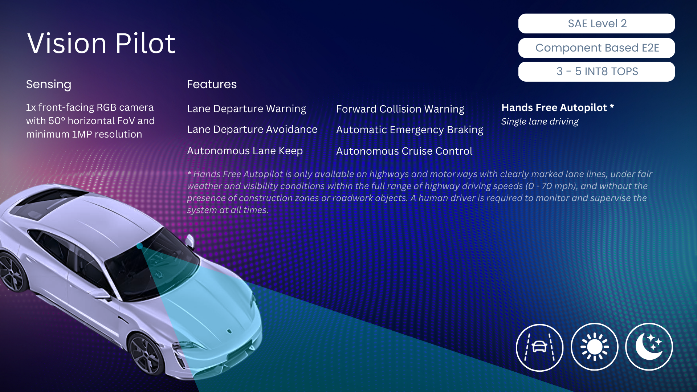

# Vision Pilot

Vision Pilot is a productionizable and safety certifiable fully open-source Level 2 autonomous driving system designed for integration with automotive OEMs and Tier-1 suppliers in series production vehicles. It utilizes a single front-facing RGB camera with a 50 horizontal-degree FoV to enable ADAS features and in-lane autopilot on highways. Vision Pilot is designed to run in real-time on embedded edge hardware which can support between 8 to 10 INT8 TOPS. 

### production_release

The latest, stable, production-ready technology release of Vision Pilot

### development_releases

A staging environment where latest features are added before a Vision Pilot release is production-ready, at which point it is migrated to the production_release folder

### middleware_recipes

Vision Pilot is structured as a standalone C++ application without any middleware requirement. To support integration with Middleware solutions, we provide multiple middleware recipes which show how Vision Pilot could be integrated with popular middlewares including IceOryx, ZENOH, and ROS2.

### simulation

Integration of Vision Pilot wth multiple simulation platforms for testing, inclduing SODA.sim and CARLA.

### software_defined_vehicle

Containerization of Vision Pilot technologies for use in software-defined vehicle frameworks